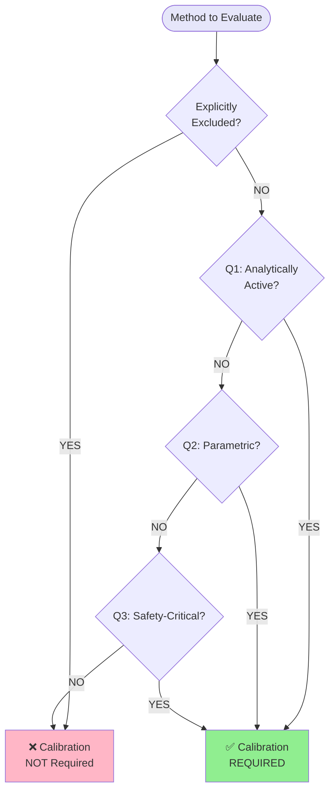

# Decision Automaton: Calibration Requirement

**Version**: 1.0.0  
**Last Updated**: 2025-12-03  
**Source**: `intrinsic_calibration_rubric.json` § calibration_triggers

---

## Purpose

This document defines the **3-question decision automaton** for determining whether a method requires calibration. The decision flow implements a systematic approach to distinguish analytical methods from non-analytical utilities.

---

## Decision Rule

```
IF any_question_returns_YES AND method_NOT_explicitly_excluded
THEN calibration_REQUIRED
ELSE calibration_NOT_REQUIRED
```

---

## The Three Questions

### Q1: Analytically Active?

> **Question**: Can this method change what is true in the pipeline?

**Indicators**:
- Method name contains analytical verbs
- Docstring describes computation, evaluation, or transformation
- Method performs data transformations that affect results

**Analytical Verbs**:
```
score, compute, calculate, evaluate, assess, validate,
filter, select, transform, aggregate, detect, extract,
classify, rank, weight, normalize, calibrate, adjust,
infer, predict, estimate, measure, analyze, process
```

**Check locations**:
- Method name
- Docstring

**Examples**:

| Method | Q1 Answer | Justification |
|:-------|:----------|:--------------|
| `compute_score(text)` | **YES** | Contains "compute" (analytical verb) |
| `filter_relevant_docs(docs)` | **YES** | Contains "filter" (analytical verb) |
| `get_config_path()` | **NO** | Simple getter, no analytical verb |
| `__init__(config)` | **NO** | Constructor, non-analytical |

---

### Q2: Parametric?

> **Question**: Does it encode assumptions or knobs that matter?

**Indicators**:
- Method uses thresholds, priors, weights, or parameters
- Docstring mentions models, rules, heuristics, or assumptions
- Method belongs to analytical layers (analyzer, processor, executor)

**Parametric Keywords**:
```
threshold, prior, weight, parameter, coefficient,
model, rule, heuristic, assumption, criterion
```

**Check locations**:
- Docstring
- Layer membership: `analyzer`, `processor`, `executor`

**Examples**:

| Method | Q2 Answer | Justification |
|:-------|:----------|:--------------|
| `apply_threshold(score, min_val=0.5)` | **YES** | Uses parametric threshold (default 0.5) |
| `bayesian_update(prior, evidence)` | **YES** | Contains "prior" (parametric keyword) |
| `extract_text(document)` | **NO** | Pure extraction, no parameters |
| `to_json()` | **NO** | Serialization, no assumptions |

---

### Q3: Safety-Critical?

> **Question**: Would a bug/misuse materially mislead an evaluation?

**Indicators**:
- Method belongs to critical layers
- Returns evaluative types (scores, metrics, structured data)
- Not a simple getter

**Critical Layers**:
```
analyzer, processor, orchestrator
```

**Evaluative Return Types**:
```
float, int, dict, list
```

**Exclusions**:
- Simple getters (excluded even if in critical layer)

**Examples**:

| Method | Layer | Return Type | Q3 Answer | Justification |
|:-------|:------|:------------|:----------|:--------------|
| `compute_evidence_score(doc)` | analyzer | float | **YES** | Critical layer + evaluative return |
| `rank_candidates(items)` | processor | list | **YES** | Critical layer + evaluative return |
| `format_output(data)` | orchestrator | str | **NO** | Non-evaluative return type |
| `get_layer_name()` | analyzer | str | **NO** | Simple getter |

---

## Decision Flow Diagram



---

## Worked Examples

### Example 1: `compute_quality_score`

```python
def compute_quality_score(self, document: PDT, threshold: float = 0.7) -> float:
    """Evaluate document quality against threshold."""
    raw_score = self._calculate_raw_metrics(document)
    return 1.0 if raw_score >= threshold else raw_score / threshold
```

**Decision Path**:
1. **Excluded?** NO (not matching any exclusion pattern)
2. **Q1: Analytically Active?** **YES** 
   - Method name: "compute" (analytical verb) ✓
3. **Result**: ✅ **CALIBRATION REQUIRED**

---

### Example 2: `get_config_path`

```python
def get_config_path(self) -> Path:
    """Return the configuration file path."""
    return self._config_path
```

**Decision Path**:
1. **Excluded?** NO (but qualifies for dynamic exclusion: pure getter)
2. **Q1: Analytically Active?** **NO**
   - Method name: "get" (not analytical)
   - No analytical verbs in docstring ✗
3. **Q2: Parametric?** **NO**
   - No parametric keywords ✗
4. **Q3: Safety-Critical?** **NO**
   - Return type: Path (not evaluative) ✗
5. **Result**: ❌ **CALIBRATION NOT REQUIRED**

---

### Example 3: `__init__`

```python
def __init__(self, config: dict):
    """Initialize analyzer with configuration."""
    self.config = config
    self.threshold = config.get('threshold', 0.5)
```

**Decision Path**:
1. **Excluded?** **YES** (magic method: `__init__`)
2. **Result**: ❌ **CALIBRATION NOT REQUIRED**

---

### Example 4: `filter_high_quality_plans`

```python
def filter_high_quality_plans(self, plans: List[PDT], min_quality: float = 0.6) -> List[PDT]:
    """Filter plans meeting minimum quality threshold."""
    return [p for p in plans if self.assess_quality(p) >= min_quality]
```

**Decision Path**:
1. **Excluded?** NO
2. **Q1: Analytically Active?** **YES**
   - Method name: "filter" (analytical verb) ✓
3. **Result**: ✅ **CALIBRATION REQUIRED**

---

### Example 5: `to_dict`

```python
def to_dict(self) -> dict:
    """Convert method metadata to dictionary."""
    return {
        "id": self.method_id,
        "layer": self.layer,
        "role": self.role
    }
```

**Decision Path**:
1. **Excluded?** **YES** (serialization pattern: `to_dict`)
2. **Result**: ❌ **CALIBRATION NOT REQUIRED**

---

## Summary Table

| Question | Focus | Key Indicators | Weight |
|:---------|:------|:---------------|:-------|
| **Q1: Analytically Active** | Semantic impact | Analytical verbs in name/docs | **High** |
| **Q2: Parametric** | Assumption encoding | Thresholds, weights, models | **Medium** |
| **Q3: Safety-Critical** | Failure consequence | Critical layer + evaluative output | **Medium** |

**Combined Logic**: `ANY(Q1, Q2, Q3) ∧ ¬EXCLUDED → CALIBRATE`

---

## Implementation

The decision automaton is implemented in:

1. **`rigorous_calibration_triage.py`**: Pre-calibration filtering
2. **`intrinsic_calibration_rubric.json`**: Machine-readable decision rules
3. **Automated tests**: `test_calibration_decision_automaton.py`

---

## References

- **Rubric Source**: [`intrinsic_calibration_rubric.json`](file:///Users/recovered/Applications/F.A.R.F.A.N%20-MECHANISTIC-PIPELINE/src/farfan_pipeline/core/calibration/intrinsic_calibration_rubric.json) § calibration_triggers
- **Exclusion Rules**: [`exclusion_rules.md`](file:///Users/recovered/Applications/F.A.R.F.A.N%20-MECHANISTIC-PIPELINE/docs/calibration/exclusion_rules.md)
- **Canonical Specification**: [`CALIBRATION_CANONICAL_COHERENCE_ANALYSIS.md`](file:///Users/recovered/Applications/F.A.R.F.A.N%20-MECHANISTIC-PIPELINE/CALIBRATION_CANONICAL_COHERENCE_ANALYSIS.md)
