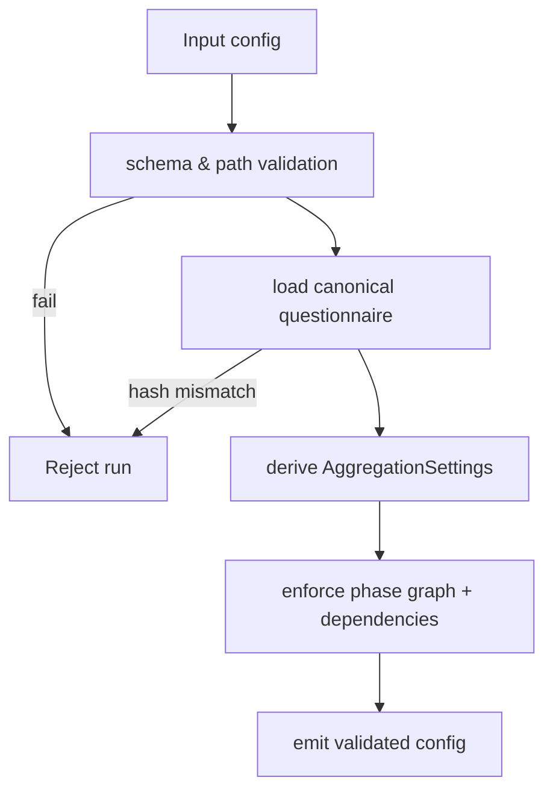
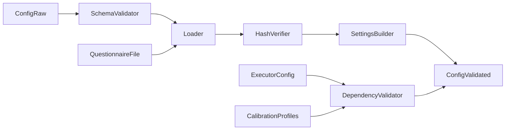
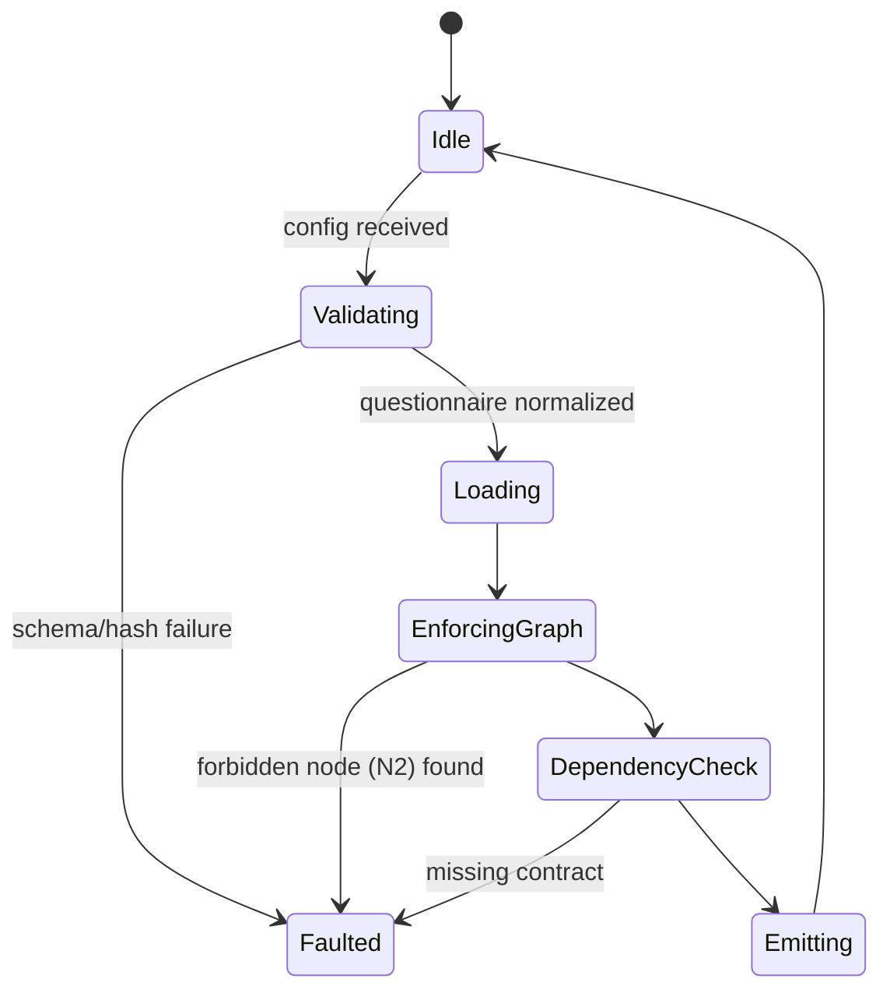
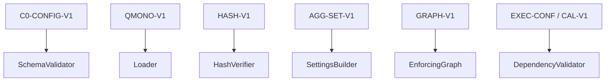

# P00-EN v1.0 — Phase 0 (Configuration Validation) Doctrine

## Canonical Node Summary
- **Node ID:** N0  
- **Upstream:** External invocation (CLI/API)  
- **Downstream:** N1 (Document Ingestion)  
- **Purpose:** Validate runtime configuration, questionnaire integrity, dependency manifests, and pre-load deterministic assets before any document enters the pipeline.

## Input Contract
- **Route:** `config` dict assembled by orchestrator entry point.
- **Required keys:** `monolith_path`, `questionnaire_hash`, `executor_config_path`, `calibration_profile`, `abort_on_insufficient`, `resource_limits`.
- **Preconditions:**
  - Files referenced by config exist and are readable, immutable (MappingProxy preferred).
  - Questionnaire provider boundary enforcement active; no external modules bypass it.
  - Phase graph identity matches `N_active = {N0,N1,N3,N4,N5,N6,N7}`.
- **Forbidden inputs:** missing hash, mutable monolith dicts, config from untrusted graphs, presence of N2 references.

## Output Contract
- **Type:** Validated `config` dict plus cached questionnaire and AggregationSettings.
- **Postconditions:**
  - `config["monolith"]` contains normalized, hash-verified canonical questionnaire.
  - `_aggregation_settings` seeded with `AggregationSettings.from_monolith`.
  - `config["_phase_graph"]` registered as canonical sequence.

## Internal Flow
1. **Schema validation:** Ensure required keys, correct types, file paths.
2. **Questionnaire loading:** Invoke canonical loader, verify hash, set provider data.
3. **Graph enforcement:** Confirm N2 absent, only nodes in N_active.
4. **Dependency sanity:** Load executor config, calibration profiles, seeds registries.
5. **Emission:** Cache validated config in orchestrator context.

### Control-Flow Graph

### Data-Flow Graph

### State-Transition Graph

### Contract-Linkage Graph

## Complexity Constraints
- **Subnodes:** max 6 (schema validator, loader, hash verifier, settings builder, graph enforcer, dependency checker).
- **Decision depth:** ≤4 (schema, hash, graph, dependency).
- **Coupling:** questionnaire loader, AggregationSettings, dependency registries only.

## Error Handling
- Hash mismatch ➜ abort run, instruct operator to rebuild questionnaire.
- Missing dependency config ➜ abort; never fall back to defaults.
- Detection of N2 in phase list ➜ log critical and reject run.

## Upstream/Downstream Links
- **Upstream:** CLI/adapter must provide immutable config (no user overrides mid-run).
- **Downstream (N1):** expects validated `config` with canonical questionnaire and resource limits.

## Change Management
- Any new config field must update this doc + Spanish counterpart.
- Hash policy or AggregationSettings init changes require version bump (e.g., `P00-EN_v1.1`).
