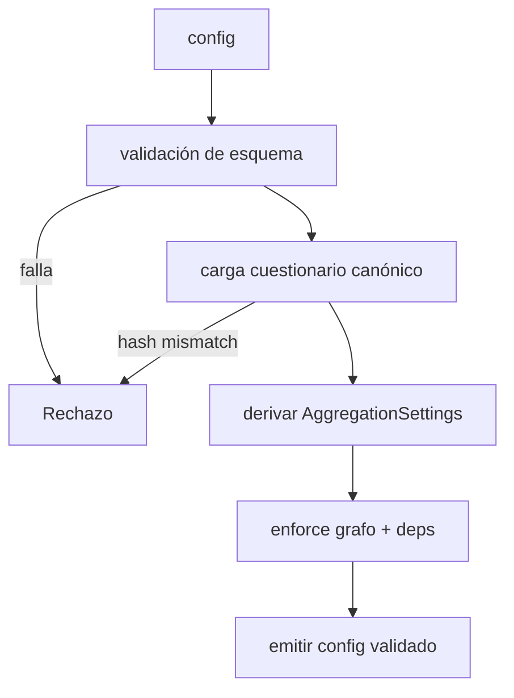
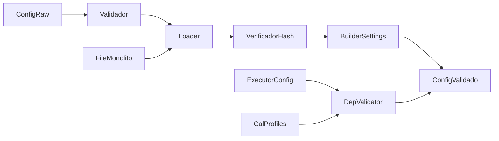
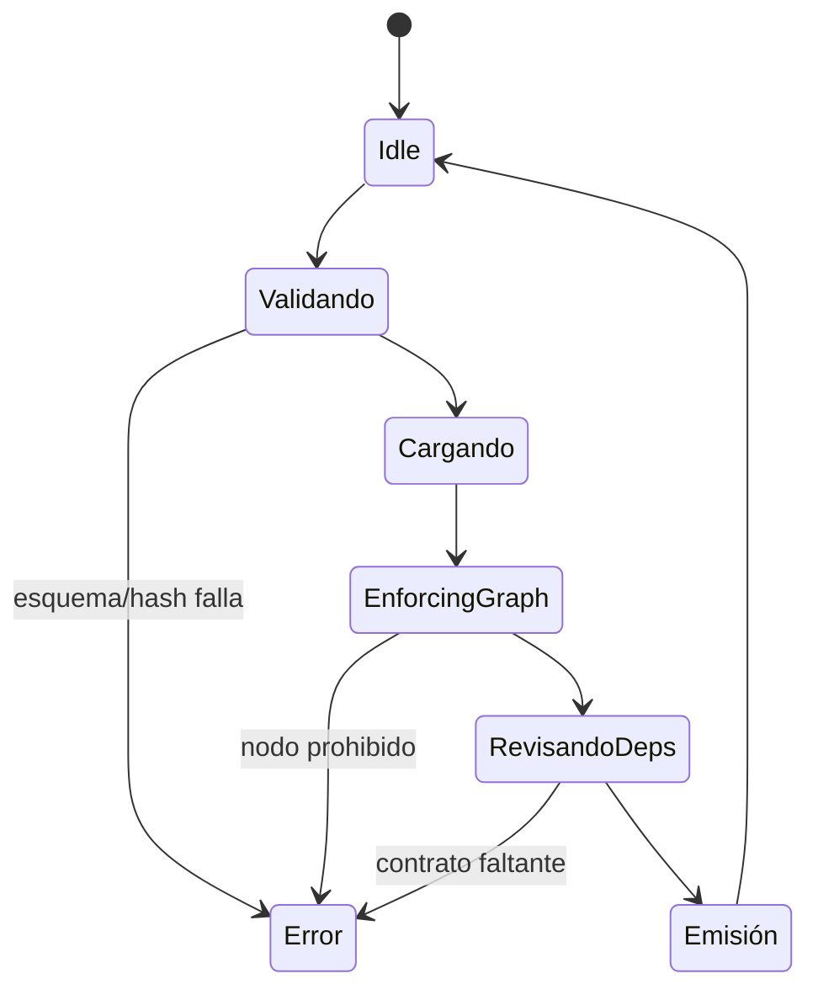
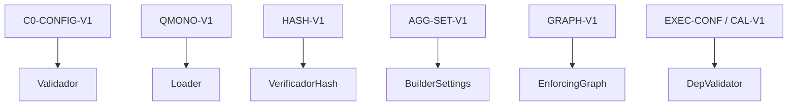

# P00-ES v1.0 — Doctrina de Fase 0 (Validación de Configuración)

## Resumen del Nodo Canónico
- **ID del nodo:** N0  
- **Upstream:** Invocación externa (CLI/API)  
- **Downstream:** N1 (Ingestión de Documento)  
- **Propósito:** Validar configuración, integridad del cuestionario y dependencias deterministas antes de permitir el ingreso de cualquier documento.

## Contrato de Entrada
- **Ruta:** diccionario `config` armado por el punto de entrada del orquestador.
- **Claves obligatorias:** `monolith_path`, `questionnaire_hash`, `executor_config_path`, `calibration_profile`, `abort_on_insufficient`, `resource_limits`.
- **Precondiciones:**
  - Archivos referenciados existen y son de solo lectura.
  - Provider del cuestionario respeta boundary enforcement.
  - El grafo de fases reporta `N_active = {N0,N1,N3,N4,N5,N6,N7}`.
- **Entradas prohibidas:** hash ausente, monolito mutable, configuraciones provenientes de grafos experimentales, referencias activas a N2.

## Contrato de Salida
- **Tipo:** `config` validado con cuestionario cacheado.
- **Postcondiciones:**
  - `config["monolith"]` contiene el cuestionario canónico normalizado y verificado.
  - `_aggregation_settings` inicializado con `AggregationSettings.from_monolith`.
  - `config["_phase_graph"]` fija la secuencia autorizada.

## Flujo Interno
1. **Validación de esquema:** Verificar llaves y tipos.
2. **Carga del cuestionario:** Usar loader canónico, verificar hash, registrar provider.
3. **Enforce del grafo:** Confirmar ausencia de N2 u otros nodos no declarados.
4. **Dependencias:** Cargar executor config, perfiles de calibración, seeds.
5. **Emisión:** Guardar config validado en el contexto del orquestador.

### Grafo de Control

### Grafo de Flujo de Datos

### Grafo de Estados

### Grafo de Enlace Contractual

## Restricciones de Complejidad
- **Subnodos:** máximo 6.
- **Profundidad decisional:** ≤4.
- **Acoplamiento:** loader del cuestionario, AggregationSettings y registries de dependencias.

## Manejo de Errores
- Hash incorrecto ➜ abortar y solicitar reconstrucción del cuestionario.
- Dependencia faltante ➜ abortar; no se permiten defaults.
- Detección de N2 ➜ log crítico y rechazo del run.

## Enlaces Upstream/Downstream
- **Upstream:** debe proveer config inmutable.
- **Downstream (N1):** espera config validado con cuestionario y límites de recursos.

## Gestión de Cambios
- Nuevos campos de config requieren actualizar este documento y su versión EN.
- Cambios en política de hash o inicialización de settings ➜ incrementar versión (`P00-ES_v1.1`).
