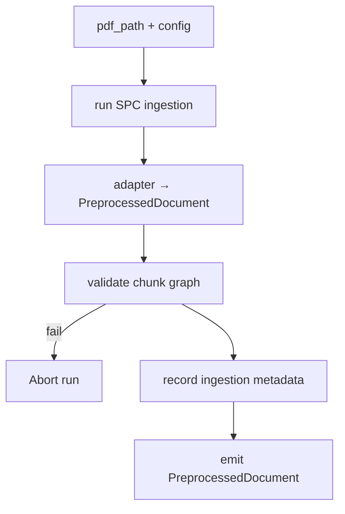
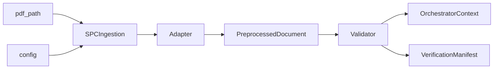
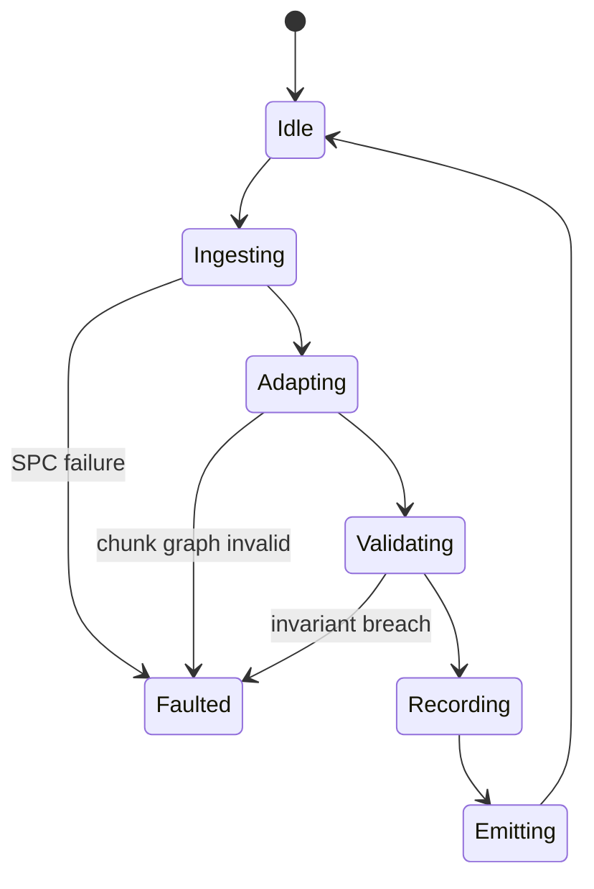
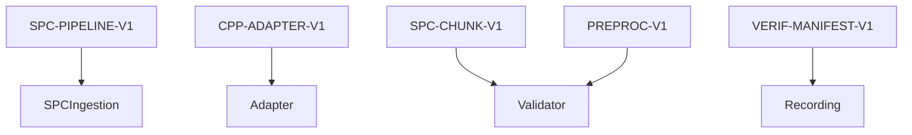

# P01-EN v1.0 — Phase 1 (Document Ingestion) Doctrine

## Canonical Node Summary
- **Node ID:** N1  
- **Upstream:** N0 validated config + raw PDF/inputs  
- **Downstream:** N3 (Micro Question Execution) via PreprocessedDocument  
- **Purpose:** Transform the Canonical Policy Package (CPP) into a chunked `PreprocessedDocument` with 60 Smart Policy Chunks (SPC) and all metadata required for determinism.

## Input Contract
- **Route:** `process_development_plan_async(pdf_path, preprocessed_document=None, config)`  
- **Required inputs:**  
  - `pdf_path` pointing to canonical source file.  
  - `config` validated by N0 (includes monolith, signal registry, calibration context).  
- **Optional override:** pre-parsed `PreprocessedDocument` (for diagnostics) must pass schema validation.
- **Preconditions:**  
  - PDF accessible, checksum recorded.  
  - Adapter (SPC) version pinned; chunk strategy declared (`semantic`).  
- **Forbidden inputs:** partially parsed payloads, documents without policy metadata, any reference to Phase 2 experimental adapters.

## Output Contract
- **Type:** `PreprocessedDocument` dataclass with fields: `document_id`, `raw_text`, `sentences`, `tables`, `metadata`, `chunks`, `chunk_index`.  
- **Postconditions:**  
  - Exactly 60 SPC chunks with PA×DIM tags.  
  - `metadata.chunk_count == 60`, `processing_mode == "chunked"`.  
  - Chunks contain `policy_area_id` and `dimension_id` for routing.

## Internal Flow
1. **CPP ingestion:** Run SPC ingestion pipeline (PhaseOrchestrator Layer 1) to produce CanonPolicyPackage.  
2. **Adapter step:** Convert CPP to PreprocessedDocument (chunk extraction, normalization, metadata).  
3. **Validation:** Ensure chunk count, chunk graph, processing mode, non-empty text.  
4. **Context recording:** Store ingestion info for verification manifest.  
5. **Emission:** Return `PreprocessedDocument` to orchestrator context.

### Control-Flow Graph

### Data-Flow Graph

### State-Transition Graph

### Contract-Linkage Graph

## Complexity Constraints
- **Subnodes:** max 5 (SPC ingestion, adapter, validator, manifest recorder, emission).  
- **Decision depth:** ≤3 (ingestion outcome, adapter validation, chunk invariants).  
- **Coupling:** Only SPC pipeline, adapter, verification manifest, orchestrator context.

## Error Handling
- SPC/adapter exceptions propagate as fatal; document is rejected.  
- Empty text or zero chunks trigger explicit `ValueError`.  
- Chunk metadata missing PA×DIM leads to abort with diagnostic entry.

## Upstream/Downstream Links
- **Upstream:** ensures config integrity (N0) and provides canonical PDF.  
- **Downstream (N3):** requires `PreprocessedDocument` with chunk graph, chunk metadata, `document_id`, and ingestion metrics stored in context.

## Change Management
- Any change to chunk count, adapter behavior, or SPC pipeline requires updating this doc + ES version and bumping label (e.g., `P01-EN_v1.1`).  
- Addition of new chunk attributes must be reflected in `PreprocessedDocument` schema contract.
