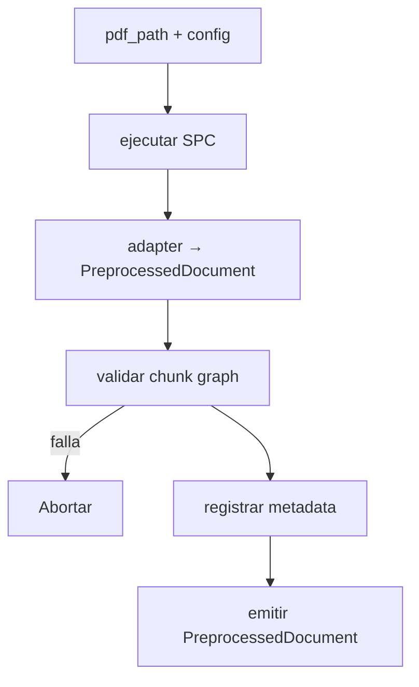
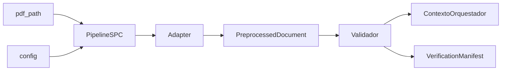
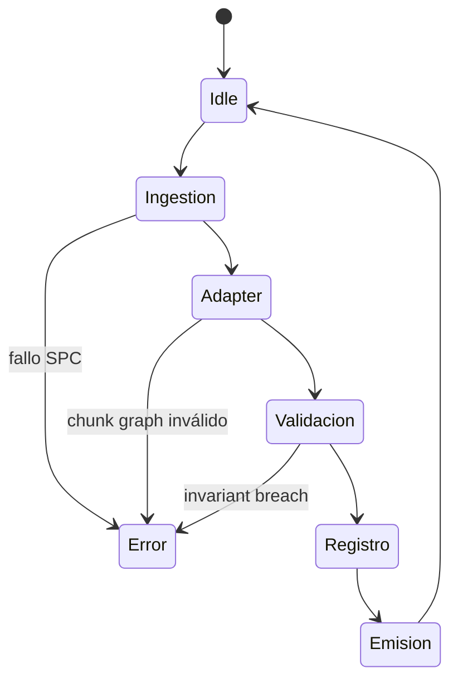
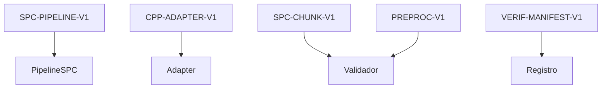

# P01-ES v1.0 — Doctrina de Fase 1 (Ingestión de Documento)

## Resumen del Nodo Canónico
- **ID del nodo:** N1  
- **Upstream:** Configuración validada en N0 + PDF crudo  
- **Downstream:** N3 (Ejecución de Micro Preguntas) a través de `PreprocessedDocument`  
- **Propósito:** Transformar el Canonical Policy Package (CPP) en un `PreprocessedDocument` chunkado con los 60 Smart Policy Chunks (SPC) y toda la metadata determinista.

## Contrato de Entrada
- **Ruta:** `process_development_plan_async(pdf_path, preprocessed_document=None, config)`  
- **Entradas requeridas:**  
  - `pdf_path` con el archivo fuente canónico.  
  - `config` validado (contiene monolito, signal registry, calibración).  
- **Override opcional:** `PreprocessedDocument` para diagnóstico debe pasar el esquema.  
- **Precondiciones:**  
  - PDF accesible, checksum registrado.  
  - Versión del adaptador SPC fijada; `chunk_strategy="semantic"`.  
- **Entradas prohibidas:** payloads parcialmente parseados, documentos sin metadata de política, referencias a un Phase 2 experimental.

## Contrato de Salida
- **Tipo:** `PreprocessedDocument`.  
- **Postcondiciones:**  
  - 60 chunks SPC etiquetados por Área × Dimensión.  
  - `metadata.chunk_count == 60`, `processing_mode == "chunked"`.  
  - Cada chunk contiene `policy_area_id` y `dimension_id`.

## Flujo Interno
1. **Ingestión SPC:** Ejecutar pipeline SPC para obtener CanonPolicyPackage.  
2. **Adaptador:** Convertir CPP en PreprocessedDocument (chunks, metadata, índices).  
3. **Validación:** Garantizar chunk count, chunk graph, texto no vacío.  
4. **Registro:** Guardar información de ingestión para el Verification Manifest.  
5. **Emisión:** Retornar `PreprocessedDocument` al contexto del orquestador.

### Grafo de Control

### Grafo de Flujo de Datos

### Grafo de Estados

### Grafo de Enlace Contractual

## Restricciones de Complejidad
- **Subnodos:** máximo 5.  
- **Profundidad decisional:** ≤3.  
- **Acoplamiento:** pipeline SPC, adapter, manifest y contexto del orquestador.

## Manejo de Errores
- Excepciones SPC/adapter ➜ abortar run.  
- Texto vacío o cero chunks ➜ `ValueError`.  
- Falta de metadata PA×DIM ➜ abortar con diagnóstico.

## Enlaces Upstream/Downstream
- **Upstream:** debe aportar config válida y PDF.  
- **Downstream (N3):** requiere `PreprocessedDocument` con chunk graph, metadata y métricas almacenadas.

## Gestión de Cambios
- Cambios en conteo de chunks o pipeline SPC ➜ actualizar este doc + versión EN y subir etiqueta (`P01-ES_v1.1`).  
- Nuevos campos en `PreprocessedDocument` ➜ actualizar contrato de esquema.
