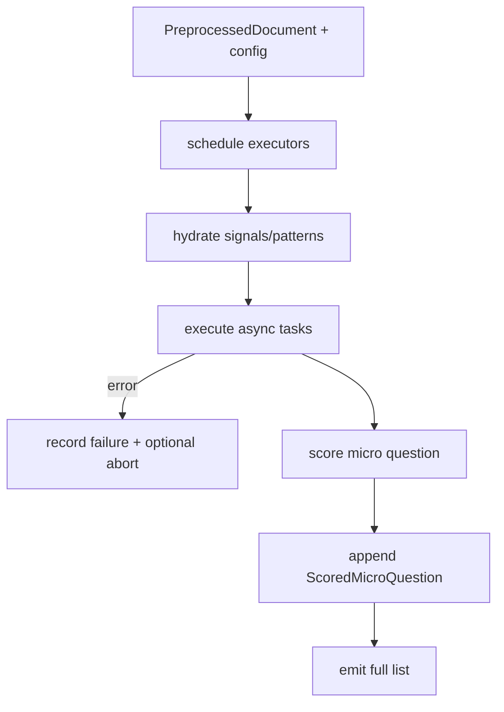
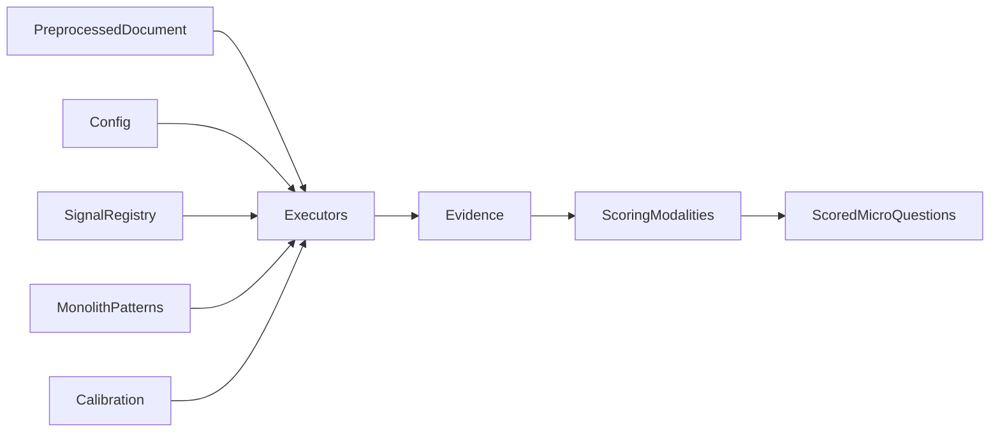
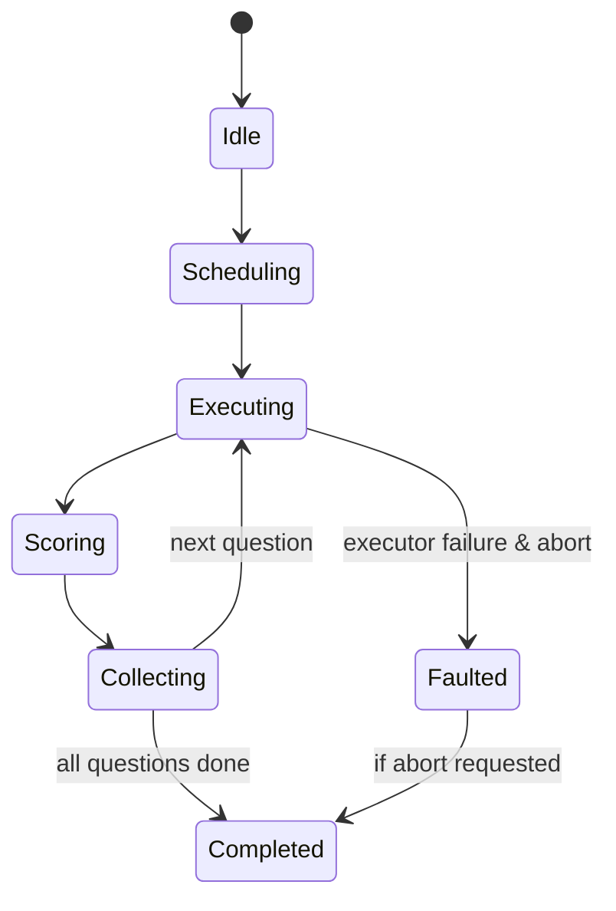
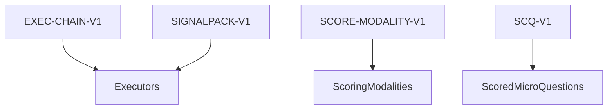

# P03-EN v1.0 — Phase 3 (Micro Execution & Scoring) Doctrine

## Canonical Node Summary
- **Node ID:** N3  
- **Upstream:** N1 (PreprocessedDocument)  
- **Downstream:** N4 (Dimension Aggregation)  
- **Purpose:** Execute the 300 micro questions using the 30 specialized executors and convert their evidence into deterministic `ScoredMicroQuestion` outputs. (Legacy N2 placeholder is disabled; all micro execution lives here.)

## Input Contract
- **Inputs:** `document: PreprocessedDocument`, `config` (with questionnaire, signal registry, calibration orchestrator), `micro_questions` list from monolith.  
- **Preconditions:**  
  - Document contains 60 SPC chunks with PA/DIM tags.  
  - Executor registry instantiated; signal registry hydrated.  
  - Seeds registry prepared for deterministic runs.  
- **Forbidden inputs:** partial documents, unlabeled chunks, unsynchronized monolith/question data.

## Output Contract
- **Type:** `List[ScoredMicroQuestion]`.  
- **Postconditions:**  
  - Exactly 300 entries unless abort request; each has `score`, `normalized_score`, `quality_level`, `scoring_details`, `metadata`.  
  - Evidence captured per question, including raw results for audit.  
  - Errors recorded with abort signal if executor fails.

## Internal Flow
1. **Executor scheduling:** iterate over question catalog; resolve executor class per slot.  
2. **Signal/context hydration:** fetch policy-area signal packs, patterns, validations, method sets.  
3. **Execution:** async tasks run `executor.execute(document, method_executor, question_context=question)`.  
4. **Scoring:** `score_micro_question` converts `MicroQuestionRun` into `ScoredMicroQuestion` using rubric modalities (TYPE_A–TYPE_F).  
5. **Abort checks:** honor `abort_signal` after each result.  
6. **Emission:** return ordered list; store in orchestrator context at key `"scored_results"`.

### Control-Flow Graph

### Data-Flow Graph

### State-Transition Graph

### Contract-Linkage Graph

## Complexity Constraints
- **Subnodes:** max 6 (scheduler, signal hydration, executor runner, evidence collector, scoring module, emitter).  
- **Decision depth:** ≤4 (executor availability, signal fallback, scoring modality branch, abort).  
- **Coupling:** method executor, signal registry, calibration orchestrator, question registry.

## Error Handling
- Executor exceptions recorded with `error` field; if fatal, propagate `AbortRequested`.  
- Scoring anomalies (missing modality) raise `RuntimeError` to abort node.  
- If `abort_signal` triggered externally, stop scheduling new tasks and flush partial results with warning.

## Upstream/Downstream Links
- **Upstream:** ensures deterministic document and config.  
- **Downstream (N4):** expects sanitized `ScoredMicroQuestion` list; no null scores or missing metadata.

## Change Management
- New modalities, executors, or signal packs require doc update + Spanish version and version bump (e.g., `P03-EN_v1.1`).  
- Any revival of structural Phase 2 must not reuse these labels until fully documented.
