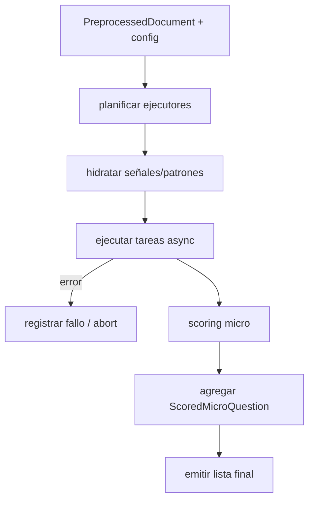
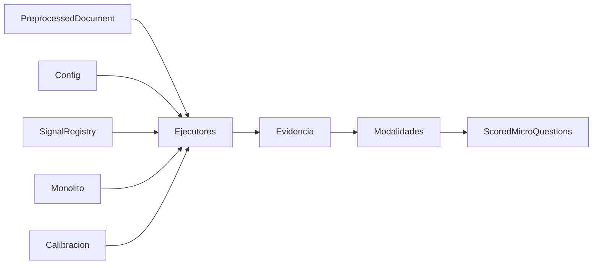
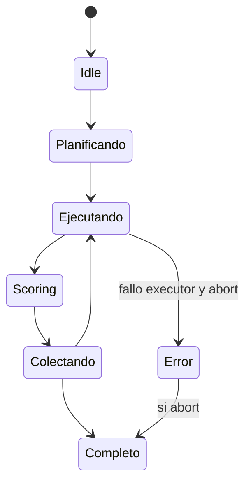
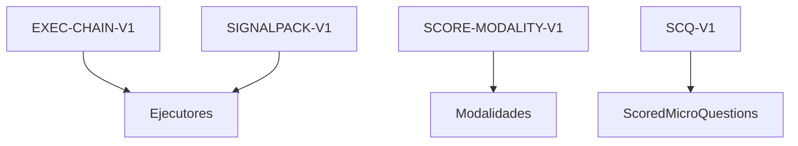

# P03-ES v1.0 — Doctrina de Fase 3 (Ejecución y Scoring Micro)

## Resumen del Nodo Canónico
- **ID del nodo:** N3  
- **Upstream:** N1 (PreprocessedDocument)  
- **Downstream:** N4 (Agregación de Dimensiones)  
- **Propósito:** Ejecutar las 300 micro preguntas con los 30 ejecutores especializados y convertir sus evidencias en `ScoredMicroQuestion` deterministas. (N2 queda reservado; toda la ejecución micro vive aquí.)

## Contrato de Entrada
- **Entradas:** `document: PreprocessedDocument`, `config`, `micro_questions` del monolito.  
- **Precondiciones:**  
  - 60 chunks SPC etiquetados.  
  - Registro de ejecutores, signal registry y calibración inicializados.  
  - Seeds registry preparado para determinismo.  
- **Entradas prohibidas:** documentos parciales, chunks sin PA/DIM, metadatos desincronizados.

## Contrato de Salida
- **Tipo:** `List[ScoredMicroQuestion]`.  
- **Postcondiciones:**  
  - 300 entradas (salvo abort); cada una con `score`, `normalized_score`, `quality_level`, `scoring_details`, `metadata`.  
  - Evidencia y resultados crudos listos para auditoría.  
  - Errores registrados con `AbortRequested` si corresponde.

## Flujo Interno
1. **Planificación:** resolver executor por slot Dim×Área.  
2. **Hidratación:** obtener SignalPack, patrones, validaciones y method_sets.  
3. **Ejecución:** tareas async corren `executor.execute(...)`.  
4. **Scoring:** convertir `MicroQuestionRun` en `ScoredMicroQuestion` según modalidad TYPE_A–TYPE_F.  
5. **Abort checks:** revisar `abort_signal` tras cada resultado.  
6. **Emisión:** retornar lista ordenada y almacenarla en el contexto (`"scored_results"`).

### Grafo de Control

### Grafo de Flujo de Datos

### Grafo de Estados

### Grafo de Enlace Contractual

## Restricciones de Complejidad
- **Subnodos:** máximo 6.  
- **Profundidad decisional:** ≤4.  
- **Acoplamiento:** method executor, signal registry, calibration orchestrator, question registry.

## Manejo de Errores
- Fallos del executor ➜ registrar error y usar `AbortRequested` si es fatal.  
- Modalidad ausente ➜ `RuntimeError` y abort.  
- `abort_signal` externo ➜ detener scheduling y devolver resultados parciales marcados.

## Enlaces Upstream/Downstream
- **Upstream:** garantiza documento determinista y config íntegra.  
- **Downstream (N4):** recibe lista limpia sin scores nulos ni metadata faltante.

## Gestión de Cambios
- Nuevas modalidades, ejecutores o señales ➜ actualizar este doc + versión EN y subir etiqueta (`P03-ES_v1.1`).  
- Cualquier reactivación del nodo N2 debe documentarse primero en esta jerarquía.
