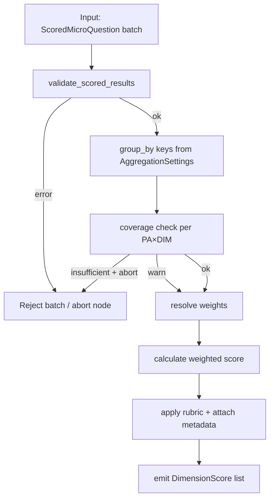
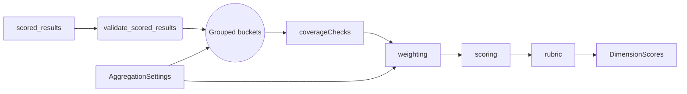
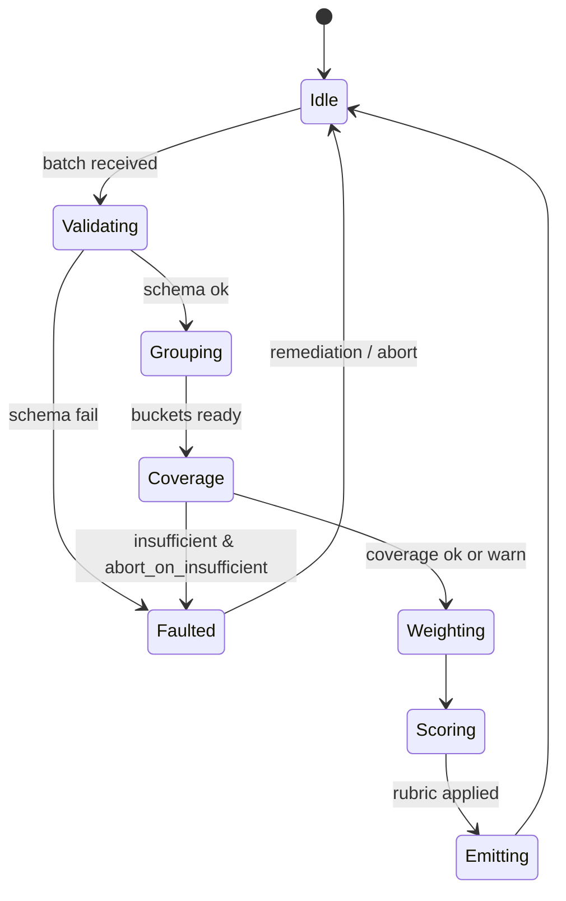
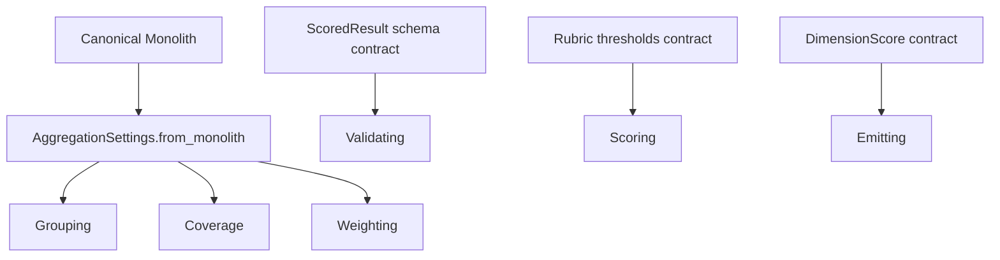

# P04-EN v1.0 — Phase 4 (Dimension Aggregation) Doctrine

## Canonical Node Summary
- **Node ID:** N4  
- **Upstream:** N3 (Scoring Micro)  
- **Downstream:** N5 (Policy Area Aggregation)  
- **Purpose:** Convert validated `ScoredMicroQuestion` objects into deterministic `DimensionScore` outputs per `(policy_area_id, dimension_id)` pair.

## Input Contract
- **Accepted route:** `scored_results` produced by `_score_micro_results_async`.
- **Format:** List[`ScoredMicroQuestion`] with mandatory fields `score`, `normalized_score`, `quality_level`, `metadata.policy_area_id`, `metadata.dimension_id`, `base_slot`, `question_global`.
- **Preconditions:**
  - Every element passes schema validation (no missing keys, numeric scores within `[0, 3]`).
  - Monolith payload already normalized and cached in `config["monolith"]`.
  - No `None` scores; errored questions must be filtered upstream.
- **Forbidden inputs:** legacy dicts lacking metadata, partial results, or any object produced outside Phase 3.

## Output Contract
- **Type:** List[`DimensionScore`].
- **Cardinality:** Up to 60 (6 dimensions × 10 policy areas). Missing combos are explicitly marked with `validation_passed=False`.
- **Postconditions:** Each `DimensionScore` includes contributing question IDs, score, quality band, validation metadata, and inherits upstream provenance IDs.

## Internal Flow
1. **Normalization & validation:** Convert payloads to `ScoredResult` via `validate_scored_results`.
2. **Grouping:** Use `aggregation_settings.dimension_group_by_keys` (default `["policy_area", "dimension"]`).
3. **Coverage enforcement:** Compare counts against `dimension_expected_counts`; raise or flag if insufficient.
4. **Weight resolution:** Apply `dimension_question_weights`; fallback to equal weights if missing entries or negative weights.
5. **Scoring:** Compute weighted average, clamp to `[0, 3]`, apply rubric thresholds (EXCELENTE ≥0.85, BUENO ≥0.70, ACEPTABLE ≥0.55).
6. **Emission:** Produce `DimensionScore` list and record instrumentation metrics (items total, latency).

### Control-Flow Graph

### Data-Flow Graph

### State-Transition Graph

### Contract-Linkage Graph

## Complexity Constraints
- **Internal subnodes:** max 6 (validator, grouper, coverage checker, weighting, scoring, emission).
- **Decision depth:** ≤3 (schema → coverage → weight fallback).
- **Coupling:** Only with `AggregationSettings`, rubric definitions, and Phase 3 output schema.
- **If any limit is exceeded,** refactor into helper modules before promoting to production.

## Error Handling
- Schema violations: raise `ValidationError` and abort phase (node failure recorded).
- Coverage shortfall: if `abort_on_insufficient=True`, raise `CoverageError`; else mark score invalid with diagnostic.
- Weight anomalies: raise `WeightValidationError` when sums deviate beyond tolerance.
- Missing monolith: log fatal error, return empty list, signal orchestrator.

## Contracts & Traceability
- **Input contract ID:** `SCQ-V1`.
- **Settings contract ID:** `AGG-SET-V1`.
- **Output contract ID:** `DIM-SCORE-V1`.
- **Telemetry:** `N4.items_total`, `N4.latency_ms`, `coverage_ratio`.

## Upstream & Downstream Guarantees
- **Upstream (N3) must guarantee:** no null scores, metadata filled, evidence stored for audit.
- **Downstream (N5) receives:** stable list sorted by policy area; duplicates removed; each entry carries validation details for hermeticity checks.

## Change Management
- Every modification to weights, rubric thresholds, or schema must update this document (EN+ES) before code merges.
- Backward-incompatible changes require bumping version label (e.g., `P04-EN_v2.0.md`) and archiving prior versions under `docs/phases/archive/`.
