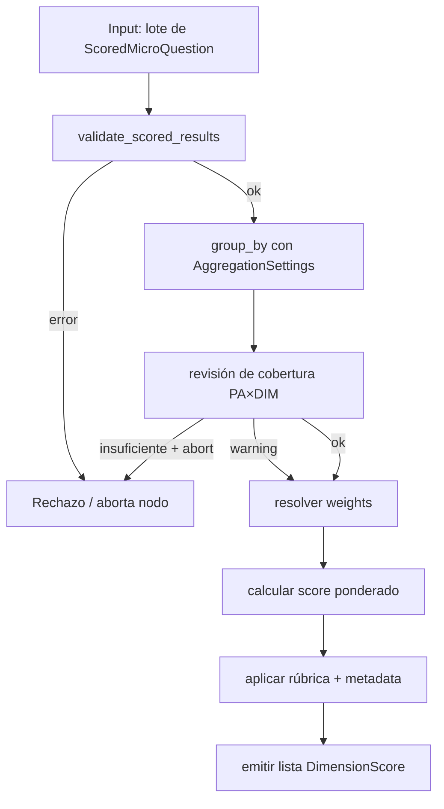
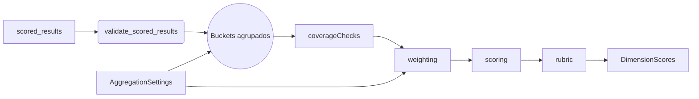
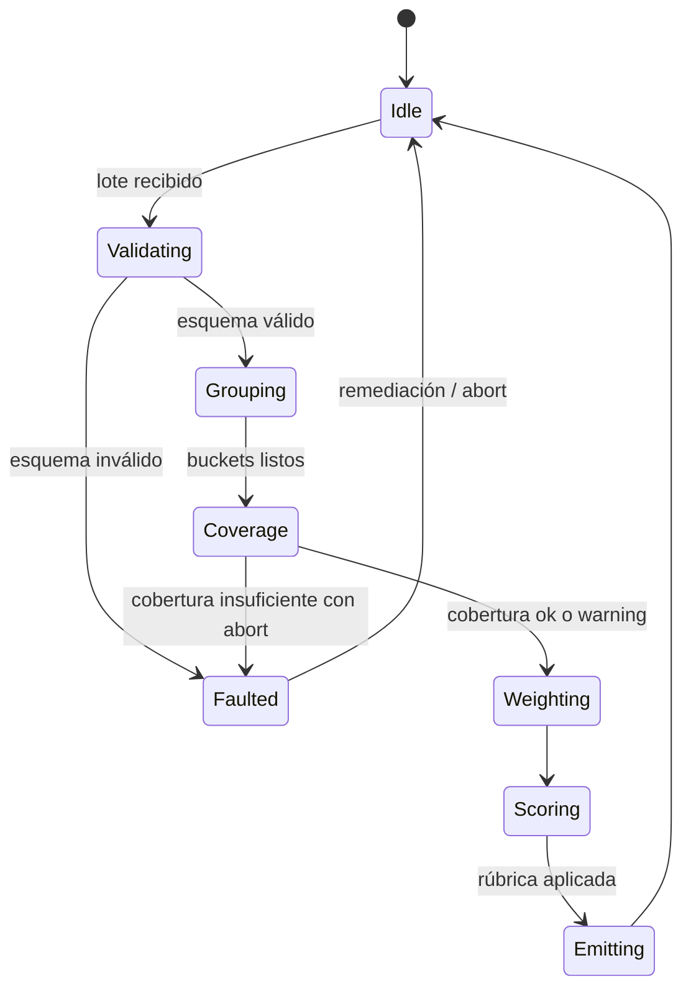
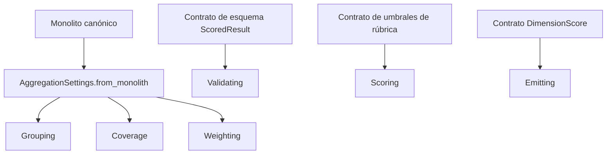

# P04-ES v1.0 — Doctrina de Fase 4 (Agregación de Dimensiones)

## Resumen del Nodo Canónico
- **ID del nodo:** N4  
- **Upstream:** N3 (Scoring Micro)  
- **Downstream:** N5 (Agregación de Áreas)  
- **Propósito:** Convertir `ScoredMicroQuestion` validados en `DimensionScore` deterministas por cada par `(policy_area_id, dimension_id)`.

## Contrato de Entrada
- **Ruta aceptada:** `scored_results` producido por `_score_micro_results_async`.
- **Formato:** Lista de `ScoredMicroQuestion` con campos obligatorios `score`, `normalized_score`, `quality_level`, `metadata.policy_area_id`, `metadata.dimension_id`, `base_slot`, `question_global`.
- **Precondiciones:**
  - Cada elemento pasa la validación de esquema (sin llaves faltantes, puntajes numéricos en `[0, 3]`).
  - El monolito ya fue normalizado y está en `config["monolith"]`.
  - No existen puntajes `None`; preguntas con error deben filtrarse antes de N4.
- **Entradas prohibidas:** diccionarios legados sin metadata, resultados parciales o artefactos ajenos a la Fase 3.

## Contrato de Salida
- **Tipo:** Lista de `DimensionScore`.
- **Cardinalidad:** Hasta 60 (6 dimensiones × 10 áreas). Los pares ausentes quedan marcados con `validation_passed=False`.
- **Postcondiciones:** Cada `DimensionScore` incluye IDs de preguntas aportantes, score, banda de calidad, metadatos de validación y trazabilidad heredada.

## Flujo Interno
1. **Normalización y validación:** Transformar entradas a `ScoredResult` mediante `validate_scored_results`.
2. **Agrupación:** Usar `aggregation_settings.dimension_group_by_keys` (por defecto `["policy_area", "dimension"]`).
3. **Cobertura:** Comparar conteos contra `dimension_expected_counts`; elevar alerta o fallo si no se cumple.
4. **Pesos:** Aplicar `dimension_question_weights`; fallback a pesos iguales si faltan entradas o hay valores negativos.
5. **Puntaje:** Calcular promedio ponderado, recortar a `[0, 3]`, aplicar umbrales de rúbrica (EXCELENTE ≥0.85, BUENO ≥0.70, ACEPTABLE ≥0.55).
6. **Emisión:** Generar la lista `DimensionScore` y registrar métricas de instrumentación (items total, latencia).

### Grafo de Control

### Grafo de Flujo de Datos

### Grafo de Transición de Estados

### Grafo de Enlace Contractual

## Restricciones de Complejidad
- **Subnodos internos:** máximo 6 (validador, agrupador, cobertura, pesos, scoring, emisión).
- **Profundidad decisional:** ≤3 (esquema → cobertura → fallback de pesos).
- **Acoplamiento:** Solo con `AggregationSettings`, rúbrica y esquema de salida de la Fase 3.
- **Si se excede algún límite,** refactorizar antes de promover cambios a producción.

## Manejo de Errores
- Violaciones de esquema: lanzar `ValidationError` y abortar el nodo (se registra en orquestador).
- Cobertura insuficiente: si `abort_on_insufficient=True`, lanzar `CoverageError`; en modo tolerante, emitir score inválido con diagnóstico.
- Anomalías de pesos: lanzar `WeightValidationError` cuando la suma se sale de tolerancia.
- Monolito ausente: registrar error fatal, devolver lista vacía y notificar al orquestador.

## Contratos y Trazabilidad
- **Contrato de entrada:** `SCQ-V1`.
- **Contrato de settings:** `AGG-SET-V1`.
- **Contrato de salida:** `DIM-SCORE-V1`.
- **Telemetría:** `N4.items_total`, `N4.latency_ms`, `coverage_ratio`.

## Garantías Upstream/Downstream
- **Upstream (N3) debe garantizar:** ausencia de puntajes nulos, metadata completa, evidencia persistida para auditoría.
- **Downstream (N5) recibe:** lista estable por área, sin duplicados, cada entrada con detalles de validación para chequeos de hermeticidad.

## Gestión de Cambios
- Toda modificación de pesos, umbrales o esquema debe reflejarse en este documento (EN+ES) antes del merge de código.
- Cambios incompatibles requieren incrementar la versión (ej. `P04-ES_v2.0.md`) y archivar versiones previas bajo `docs/phases/archive/`.
