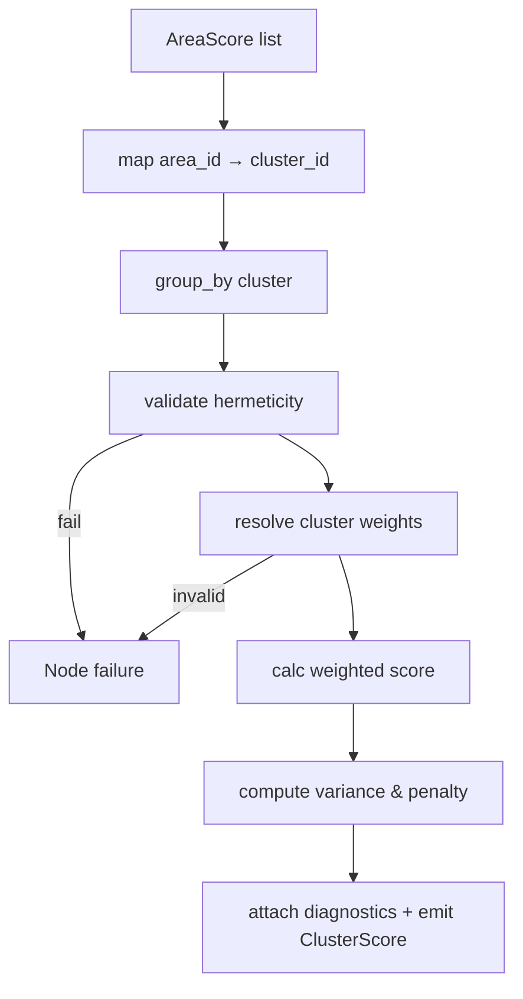
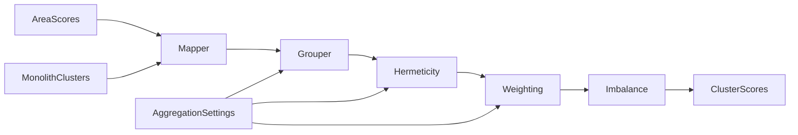
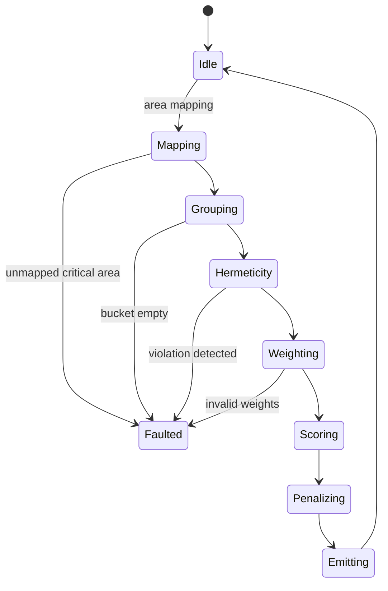
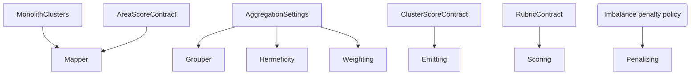

# P06-EN v1.0 — Phase 6 (Cluster Aggregation) Doctrine

## Canonical Node Summary
- **Node ID:** N6  
- **Upstream:** N5 (Policy Area Aggregation)  
- **Downstream:** N7 (Macro Evaluation)  
- **Purpose:** Aggregate `AreaScore` objects into `ClusterScore` per CL01–CL04, enforcing hermeticity, computing coherence metrics, and applying the imbalance penalty before forwarding MESO scores.

## Input Contract
- **Route:** AreaScore list with optional `cluster_id` placeholder.
- **Format:** List[`AreaScore`] with fields `area_id`, `score`, `quality_level`, `dimension_scores`.
- **Preconditions:**
  - Monolith clusters present (`blocks.niveles_abstraccion.clusters`).
  - `AggregationSettings.cluster_group_by_keys` available (default `["cluster_id"]`).
  - Each AreaScore originates from Phase 5 (policy area IDs canonical).
- **Forbidden inputs:** area IDs absent from canonical clusters, duplicate assignments, mutated AreaScores missing child dimensions.

## Output Contract
- **Type:** List[`ClusterScore`] (exactly 4 entries).
- **Fields:** `cluster_id`, `cluster_name`, `areas`, `score`, `coherence`, `variance`, `weakest_area`, `area_scores`, `validation_passed`, `validation_details`.
- **Postconditions:** Score already reflects imbalance penalty; metadata includes raw score and penalty factor.

## Internal Flow
1. **Cluster mapping:** Map each `area_id` to cluster using monolith definitions; drop or flag unmapped areas.
2. **Grouping:** Group AreaScores by `cluster_id`.
3. **Hermeticity:** Validate missing, duplicate, or unexpected areas per cluster.
4. **Weights:** Use `cluster_policy_area_weights`; fallback to equal weights.
5. **Scoring:** Compute weighted average, clamp to `[0, 3]`.
6. **Imbalance penalty:** Calculate std dev of member area scores; apply penalty factor `1 - 0.3 * min(std_dev / 3.0, 1)`.
7. **Diagnostics:** Compute coherence (inverse std), variance, weakest area, record raw score and penalty structure.
8. **Emission:** Emit ClusterScore list for N7.

### Control-Flow Graph

### Data-Flow Graph

### State-Transition Graph

### Contract-Linkage Graph

## Imbalance Penalty Specification
- **Std dev:** `σ = sqrt( Σ(a_i - μ)^2 / n )`.
- **Normalized std:** `σ_norm = min(σ / 3.0, 1)`.
- **Penalty factor:** `p = 1 - 0.3 * σ_norm`.
- **Final score:** `score_adjusted = score_raw * p`.
- **Logging:** store `{std_dev, penalty_factor, raw_score, adjusted_score}` inside `validation_details["imbalance_penalty"]`.

## Complexity Constraints
- **Subnodes:** max 7 (mapping, grouping, hermeticity, weighting, scoring, penalty, emission).
- **Decision depth:** ≤4 (mapping exceptions, hermeticity, weight fallback, penalty branch).
- **Coupling:** `AggregationSettings`, monolith cluster definitions, MacroAggregator interface.

## Error Handling
- Unmapped area: warning if optional, fatal if mandated by monolith (cluster incomplete).
- Hermeticity failure: raise `HermeticityValidationError`.
- Weight anomalies: `WeightValidationError`.
- Penalty computation errors (e.g., NaN) force fallback to raw score + diagnostic flag.

## Contracts & Telemetry
- **Input:** `AREA-SCORE-V1`.
- **Penalty policy:** `CL-PENALTY-V1`.
- **Output:** `CLUSTER-SCORE-V1`.
- **Telemetries:** `N6.items_total`, `imbalance_penalty_avg`, `hermeticity_failures`.

## Upstream/Downstream Links
- **Upstream obligations:** Provide accurate area IDs, dimension breakdown, validation details.
- **Downstream (N7):** Expects list sorted by cluster ID with full diagnostics to compute macro coherence and gaps.

## Change Management
- Any modification to penalty weights, cluster membership, or hermeticity rules must update this doc and the Spanish counterpart before code merges.
- Bump version label when contracts change (e.g., `P06-EN_v1.1`).
