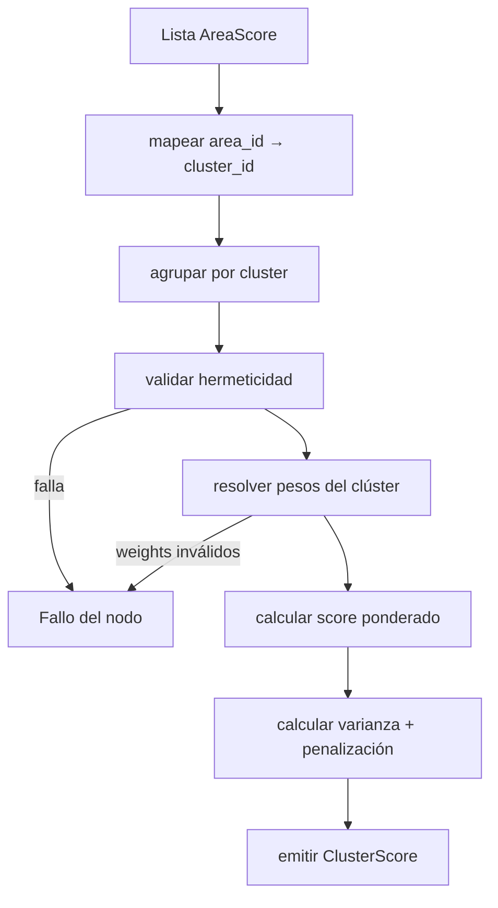
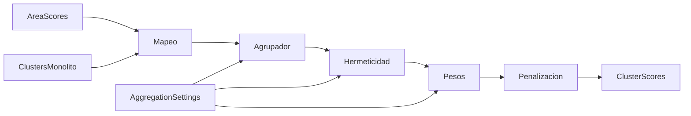
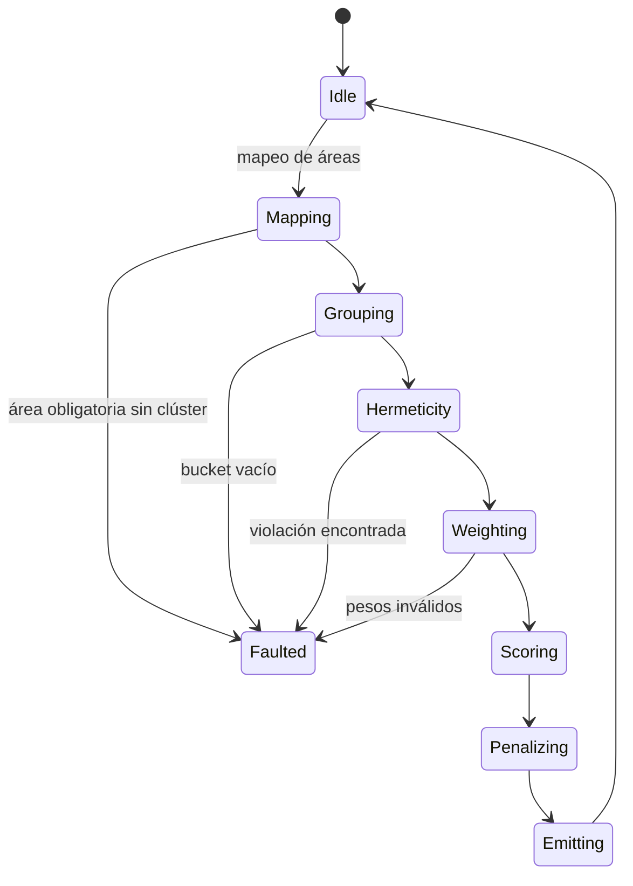
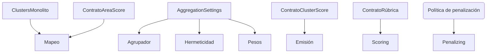

# P06-ES v1.0 — Doctrina de Fase 6 (Agregación de Clústeres)

## Resumen del Nodo Canónico
- **ID del nodo:** N6  
- **Upstream:** N5 (Agregación de Áreas)  
- **Downstream:** N7 (Evaluación Macro)  
- **Propósito:** Agregar `AreaScore` en `ClusterScore` para CL01–CL04, aplicando hermeticidad, métricas de coherencia y la penalización por desequilibrio antes de alimentar la capa MESO.

## Contrato de Entrada
- **Ruta:** Lista de AreaScore con `cluster_id` opcional.
- **Formato:** `List[AreaScore]` con `area_id`, `score`, `quality_level`, `dimension_scores`.
- **Precondiciones:**
  - Los clústeres del monolito (`blocks.niveles_abstraccion.clusters`) están cargados.
  - `aggregation_settings.cluster_group_by_keys` disponible (default `["cluster_id"]`).
  - Cada AreaScore proviene de N5.
- **Entradas prohibidas:** áreas fuera de los clústeres canónicos, asignaciones duplicadas, AreaScores sin dimensiones hijas.

## Contrato de Salida
- **Tipo:** `List[ClusterScore]` (4 entradas).
- **Campos:** `cluster_id`, `cluster_name`, `areas`, `score`, `coherence`, `variance`, `weakest_area`, `area_scores`, `validation_passed`, `validation_details`.
- **Postcondiciones:** El score ya incluye penalización; `validation_details["imbalance_penalty"]` guarda score crudo y factor aplicado.

## Flujo Interno
1. **Mapeo:** Relacionar `area_id` con `cluster_id` usando el monolito; marcar zonas sin mapeo.
2. **Agrupación:** Agrupar AreaScores por `cluster_id`.
3. **Hermeticidad:** Validar áreas faltantes, duplicadas o inesperadas por clúster.
4. **Pesos:** Aplicar `cluster_policy_area_weights`; fallback a pesos iguales.
5. **Puntaje:** Calcular promedio ponderado y recortar a `[0, 3]`.
6. **Penalización:** Calcular desviación estándar (`σ`), normalizar `σ/3.0`, aplicar factor `1 - 0.3 * min(σ/3.0, 1)`.
7. **Diagnósticos:** Calcular coherencia (inverso de `σ`), varianza, área más débil, registrar datos en metadata.
8. **Emisión:** Entregar la lista ClusterScore para N7.

### Grafo de Control

### Grafo de Flujo de Datos

### Grafo de Transición de Estados

### Grafo de Enlace Contractual

## Especificación de Penalización por Desequilibrio
- **Desviación estándar:** `σ = sqrt( Σ(a_i - μ)^2 / n )`.
- **Normalización:** `σ_norm = min(σ / 3.0, 1)`.
- **Factor:** `p = 1 - 0.3 * σ_norm`.
- **Score final:** `score_ajustado = score_bruto * p`.
- **Registro:** Guardar `{std_dev, penalty_factor, raw_score, adjusted_score}` en `validation_details["imbalance_penalty"]`.

## Restricciones de Complejidad
- **Subnodos:** máximo 7 (mapeo, agrupación, hermeticidad, pesos, scoring, penalización, emisión).
- **Profundidad decisional:** ≤4.
- **Acoplamiento:** `AggregationSettings`, definiciones de clúster del monolito, interfaz MacroAggregator.

## Manejo de Errores
- Área sin mapeo: warning si es opcional, error fatal si es obligatoria para el clúster.
- Violación de hermeticidad: `HermeticityValidationError`.
- Pesos inválidos: `WeightValidationError`.
- Errores durante penalización (NaN): usar score bruto y marcar flag de degradación.

## Contratos y Telemetría
- **Contrato de entrada:** `AREA-SCORE-V1`.
- **Política de penalización:** `CL-PENALTY-V1`.
- **Contrato de salida:** `CLUSTER-SCORE-V1`.
- **Telemetría:** `N6.items_total`, `imbalance_penalty_avg`, `hermeticity_failures`.

## Enlaces Upstream/Downstream
- **Upstream (N5):** debe proveer IDs exactos y detalles de validación.
- **Downstream (N7):** espera lista ordenada por cluster con diagnósticos para coherencia macro.

## Gestión de Cambios
- Cualquier modificación en penalización, membresía de clúster o reglas de hermeticidad debe reflejarse aquí y en el documento EN antes de mezclar código.
- Incrementar versión (ej. `P06-ES_v1.1`) ante cambios contractuales.
