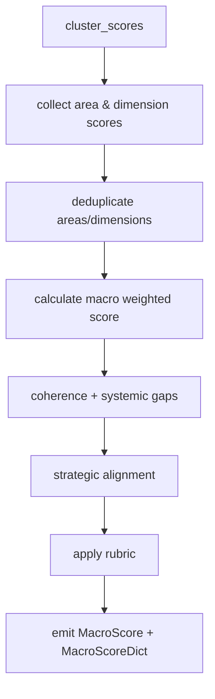
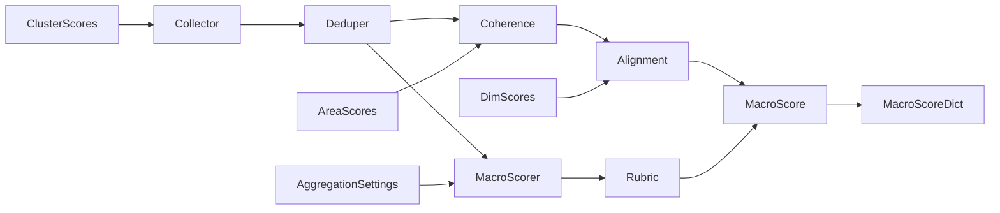
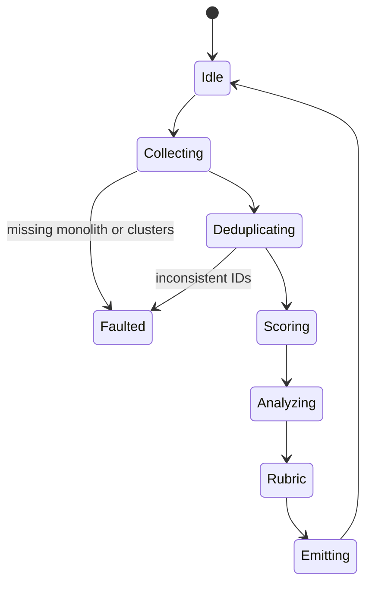
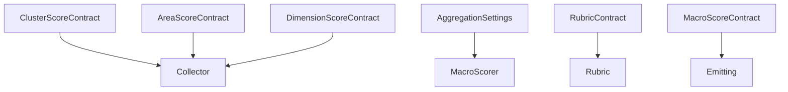

# P07-EN v1.0 — Phase 7 (Macro Evaluation) Doctrine

## Canonical Node Summary
- **Node ID:** N7  
- **Upstream:** N6 (Cluster Aggregation) + inherited Area/Dimension Scores  
- **Downstream:** N8 (Recommendations)  
- **Purpose:** Perform holistic evaluation (Q305) to produce `MacroScore` and the canonical `MacroScoreDict` used by reporting and recommendations.

## Input Contract
- **Required lists:**  
  - `cluster_scores`: List[`ClusterScore`] (4 items, adjusted scores from N6).  
  - `area_scores`: List[`AreaScore`] (10 items, deduplicated).  
  - `dimension_scores`: List[`DimensionScore`] (≤60, deduplicated).
- **Preconditions:**
  - Monolith present; AggregationSettings computed once.
  - No duplicate area/dimension combos after dedup pass.
  - ClusterScore metadata includes imbalance diagnostics.
- **Forbidden inputs:** Partial lists, mutated scores after N6, or scores whose provenance is unknown.

## Output Contract
- **MacroScore:** dataclass with fields `score`, `quality_level`, `cross_cutting_coherence`, `systemic_gaps`, `strategic_alignment`, `cluster_scores`, `validation_passed`, `validation_details`.
- **MacroScoreDict:**  
  ```python
  {
      "macro_score": MacroScore,
      "macro_score_normalized": float,
      "cluster_scores": list[ClusterScore],
      "cross_cutting_coherence": float,
      "systemic_gaps": list[str],
      "strategic_alignment": float,
      "quality_band": str
  }
  ```
- **Postconditions:** Quality band reflects rubric thresholds; coherence and alignment metrics recorded for downstream consumers.

## Internal Flow
1. **Input collection:** Flatten `cluster_scores` to dedupe area/dimension artifacts.
2. **Deduplication:** Remove repeated areas/dimensions while preserving first-seen entries.
3. **Macro scoring:** Weighted average via `_calculate_macro_score` (macro cluster weights fallback to equal weights).
4. **Coherence analysis:** `calculate_cross_cutting_coherence` uses std dev across cluster scores.
5. **Gap detection:** `identify_systemic_gaps` inspects AreaScores for `quality_level == "INSUFICIENTE"`.
6. **Strategic alignment:** Weighted combination `0.6 * cluster_coherence + 0.4 * dimension_validation_rate`.
7. **Rubric application:** Same thresholds as earlier phases (0.85 / 0.70 / 0.55).
8. **Emission:** Build MacroScore, compute normalized score (score / 3.0), wrap into MacroScoreDict with derived metrics.

### Control-Flow Graph


### Data-Flow Graph


### State-Transition Graph


### Contract-Linkage Graph


## Complexity Constraints
- **Subnodes:** max 6 (collector, deduper, macro scorer, coherence analyzer, alignment calculator, emission).
- **Decision depth:** ≤4 (dedupe conflicts, weight fallback, rubric branches).
- **Coupling:** limited to AggregationSettings, rubric policy, recommendation engine interface.

## Error Handling
- Missing monolith/aggregation settings: fatal error → placeholder MacroScore with zeros and `validation_passed=False`.
- Empty cluster_scores: emit zeroed MacroScore and log error.
- Dedup conflicts: log warning, keep first occurrence, attach detail to validation metadata.
- Any exception inside macro scoring is caught; MacroScore fallback with diagnostic is still returned to preserve pipeline continuity.

## Contracts & Telemetry
- **Input contracts:** `CLUSTER-SCORE-V1`, `AREA-SCORE-V1`, `DIM-SCORE-V1`.
- **Output contract:** `MACRO-SCORE-V1` + `MacroScoreDict`.
- **Telemetry:** `N7.latency_ms`, `systemic_gap_count`, `coherence_value`, `quality_band`.

## Upstream/Downstream Links
- **Upstream provider:** must deliver coherent cluster list (4 entries) and aligned Area/Dimension lists.
- **Downstream (recommendations/reporting):** expects MacroScoreDict with normalized score and quality band; missing fields block Phase 8.

## Change Management
- Altering macro weights, rubric thresholds, or alignment formula requires updating both language docs and contract code before deployment.
- Bump version label upon contract changes (e.g., `P07-EN_v1.1`).
