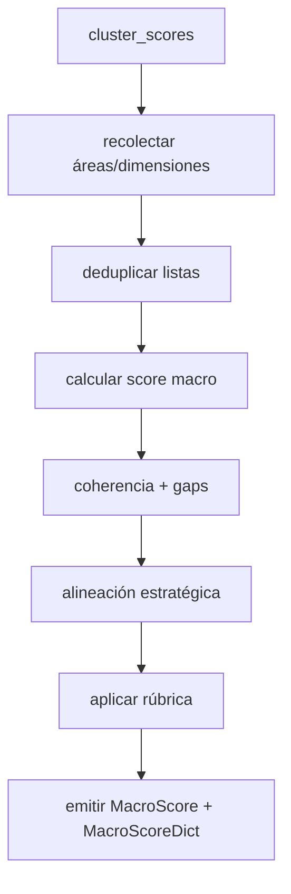
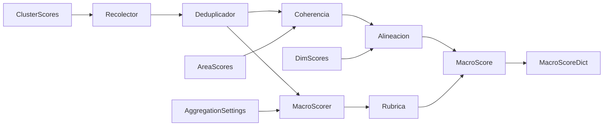
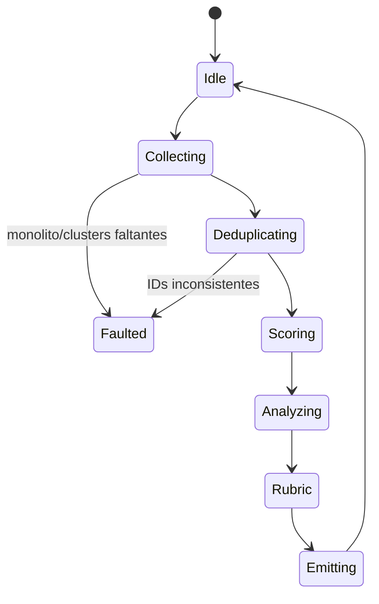
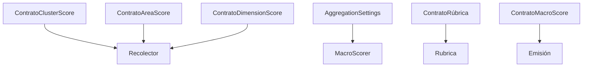

# P07-ES v1.0 — Doctrina de Fase 7 (Evaluación Macro)

## Resumen del Nodo Canónico
- **ID del nodo:** N7  
- **Upstream:** N6 (Agregación de Clústeres) + listas heredadas de Áreas y Dimensiones  
- **Downstream:** N8 (Recomendaciones)  
- **Propósito:** Ejecutar la evaluación holística (Q305) para generar `MacroScore` y el `MacroScoreDict` utilizado por reportes y recomendaciones.

## Contrato de Entrada
- **Listas requeridas:**  
  - `cluster_scores`: `List[ClusterScore]` (4 entradas ajustadas por N6).  
  - `area_scores`: `List[AreaScore]` (10 entradas deduplicadas).  
  - `dimension_scores`: `List[DimensionScore]` (≤60, sin duplicados).
- **Precondiciones:**
  - Monolito y AggregationSettings ya cargados.
  - Sin duplicados después de deduplicar áreas/dimensiones.
  - Los ClusterScore incluyen diagnósticos de desequilibrio.
- **Entradas prohibidas:** listas parciales, scores mutados post N6 o sin trazabilidad.

## Contrato de Salida
- **MacroScore:** dataclass con `score`, `quality_level`, `cross_cutting_coherence`, `systemic_gaps`, `strategic_alignment`, `cluster_scores`, `validation_passed`, `validation_details`.
- **MacroScoreDict:**  
  ```python
  {
      "macro_score": MacroScore,
      "macro_score_normalized": float,
      "cluster_scores": list[ClusterScore],
      "cross_cutting_coherence": float,
      "systemic_gaps": list[str],
      "strategic_alignment": float,
      "quality_band": str
  }
  ```
- **Postcondiciones:** La banda de calidad sigue la rúbrica; coherencia y alineación quedan listos para la fase de recomendaciones.

## Flujo Interno
1. **Recolección:** Aplanar `cluster_scores` para reunir áreas/dimensiones asociadas.
2. **Deduplicación:** Eliminar duplicados manteniendo la primera ocurrencia.
3. **Score macro:** Promedio ponderado mediante `_calculate_macro_score` (pesos macro; fallback uniforme).
4. **Coherencia transversal:** `calculate_cross_cutting_coherence` usa la desviación estándar entre clusters.
5. **Gaps sistémicos:** `identify_systemic_gaps` detecta áreas con `quality_level == "INSUFICIENTE"`.
6. **Alineación estratégica:** `0.6 * coherencia + 0.4 * tasa_validación_dimensiones`.
7. **Rúbrica:** Umbrales 0.85 / 0.70 / 0.55.
8. **Emisión:** Construir MacroScore, normalizar (score/3.0) y empaquetar en MacroScoreDict.

### Grafo de Control


### Grafo de Flujo de Datos


### Grafo de Transición de Estados


### Grafo de Enlace Contractual


## Restricciones de Complejidad
- **Subnodos:** máximo 6 (recolector, deduplicador, macro scorer, analizador de coherencia, calculador de alineación, emisión).
- **Profundidad decisional:** ≤4.
- **Acoplamiento:** AggregationSettings, rúbrica y la interfaz de recomendaciones.

## Manejo de Errores
- Monolito/aggregation settings ausentes: error fatal → MacroScore nulo con `validation_passed=False`.
- Lista de clúster vacía: MacroScore en cero + log crítico.
- Conflictos en deduplicación: warning, se conserva la primera ocurrencia y se registra en metadata.
- Excepciones internas: capturadas; se retorna MacroScore fallback para mantener continuidad.

## Contratos y Telemetría
- **Contratos de entrada:** `CLUSTER-SCORE-V1`, `AREA-SCORE-V1`, `DIM-SCORE-V1`.
- **Contrato de salida:** `MACRO-SCORE-V1` + `MacroScoreDict`.
- **Telemetría:** `N7.latency_ms`, `systemic_gap_count`, `coherence_value`, `quality_band`.

## Enlaces Upstream/Downstream
- **Upstream:** debe entregar 4 ClusterScore coherentes y listas alineadas de áreas/dimensiones.
- **Downstream (Recomendaciones/Reporte):** espera MacroScoreDict con score normalizado y banda de calidad; campos faltantes bloquean la Fase 8.

## Gestión de Cambios
- Cambios en pesos macro, umbrales o fórmula de alineación deben reflejarse aquí y en el documento EN antes de desplegar.
- Incrementar versión (`P07-ES_vX.Y`) cuando cambie el contrato.
